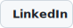
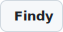
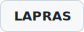
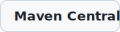

# Seiji Kohara

Software Engineer.

  <a href="https://www.linkedin.com/in/seijikohara/"><picture><source media="(prefers-color-scheme: dark)" srcset="./assets/badges/linkedin.dark.svg"></picture></a>
  <a href="https://www.facebook.com/seiji.khr/"><picture><source media="(prefers-color-scheme: dark)" srcset="./assets/badges/facebook.dark.svg"></picture></a>
  <a href="https://findy-code.io/skills-share/y0erzwXymYuaZ"><picture><source media="(prefers-color-scheme: dark)" srcset="./assets/badges/findy.dark.svg"></picture></a>
  <a href="https://lapras.com/public/seijikohara"><picture><source media="(prefers-color-scheme: dark)" srcset="./assets/badges/lapras.dark.svg"></picture></a>
  <a href="https://www.wantedly.com/id/seiji_kohara"><picture><source media="(prefers-color-scheme: dark)" srcset="./assets/badges/wantedly.dark.svg"></picture></a>
  <a href="https://qiita.com/seijikohara"><picture><source media="(prefers-color-scheme: dark)" srcset="./assets/badges/qiita.dark.svg"></picture></a>
  <a href="https://zenn.dev/seijikohara"><picture><source media="(prefers-color-scheme: dark)" srcset="./assets/badges/zenn.dark.svg"></picture></a>

<picture>
  <source media="(prefers-color-scheme: dark)" srcset="./assets/overview.dark.svg">
  
</picture>

<picture>
  <source media="(prefers-color-scheme: dark)" srcset="./assets/lifetime.dark.svg">
  
</picture>

<picture>
  <source media="(prefers-color-scheme: dark)" srcset="./assets/contributions.dark.svg">
  
</picture>

<picture>
  <source media="(prefers-color-scheme: dark)" srcset="./assets/composition.dark.svg">
  
</picture>

<picture>
  <source media="(prefers-color-scheme: dark)" srcset="./assets/rhythm.dark.svg">
  
</picture>

<picture>
  <source media="(prefers-color-scheme: dark)" srcset="./assets/languages.dark.svg">
  
</picture>

### Packages

  <a href="https://central.sonatype.com/namespace/io.github.seijikohara"><picture><source media="(prefers-color-scheme: dark)" srcset="./assets/badges/maven-central.dark.svg"></picture></a>
  <a href="https://www.npmjs.com/~seijikohara"><picture><source media="(prefers-color-scheme: dark)" srcset="./assets/badges/npm.dark.svg"></picture></a>

Cards are static SVGs regenerated every 6 hours by <a href=".github/workflows/profile.yml">a dependency-free workflow</a> in this repository. Type is set in <a href="https://fonts.google.com/specimen/Roboto">Roboto</a> and <a href="https://fonts.google.com/specimen/Roboto+Mono">Roboto Mono</a>, embedded under the <a href="https://openfontlicense.org/">SIL Open Font License 1.1</a>.
