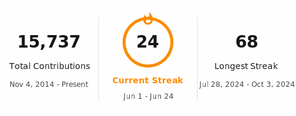
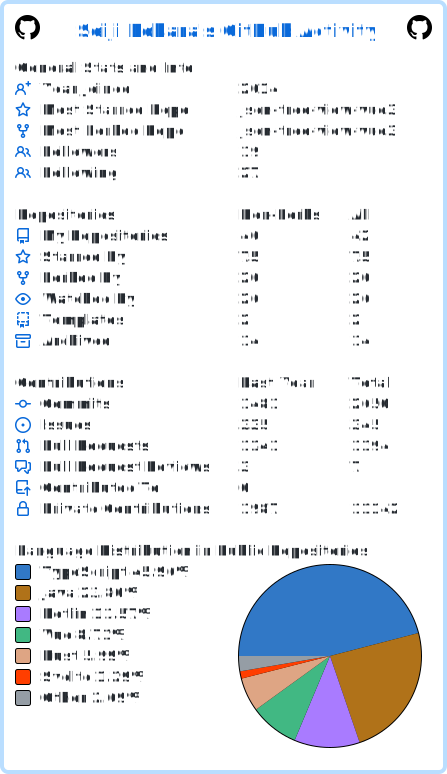

# Seiji Kohara

Software Engineer.

## 📦 Packages

## 📊 Stats

<table>
  <tr>
    <td width="50%">
      <picture>
        <source media="(prefers-color-scheme: dark)" srcset="./assets/stats.dark.svg">
        
      </picture>
    </td>
    <td width="50%">
      <picture>
        <source media="(prefers-color-scheme: dark)" srcset="./assets/top-langs.dark.svg">
        
      </picture>
    </td>
  </tr>
</table>

## 🔥 Streak

<picture>
  <source media="(prefers-color-scheme: dark)" srcset="./assets/streak.dark.svg">
  
</picture>

## 📈 Overview

<picture>
  <source media="(prefers-color-scheme: dark)" srcset="./assets/userstats.dark.svg">
  
</picture>

## 🕹️ Contribution Pac-Man

<picture>
  <source media="(prefers-color-scheme: dark)" srcset="./assets/pacman.dark.svg">
  
</picture>

---

